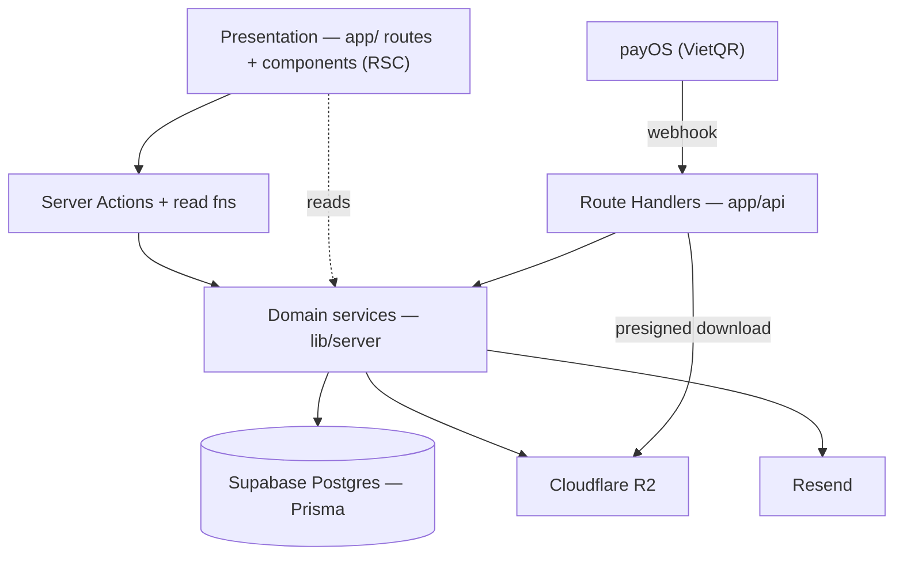
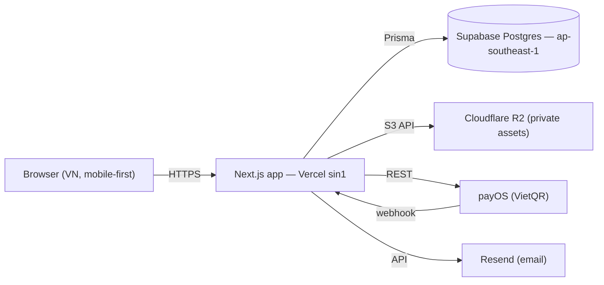
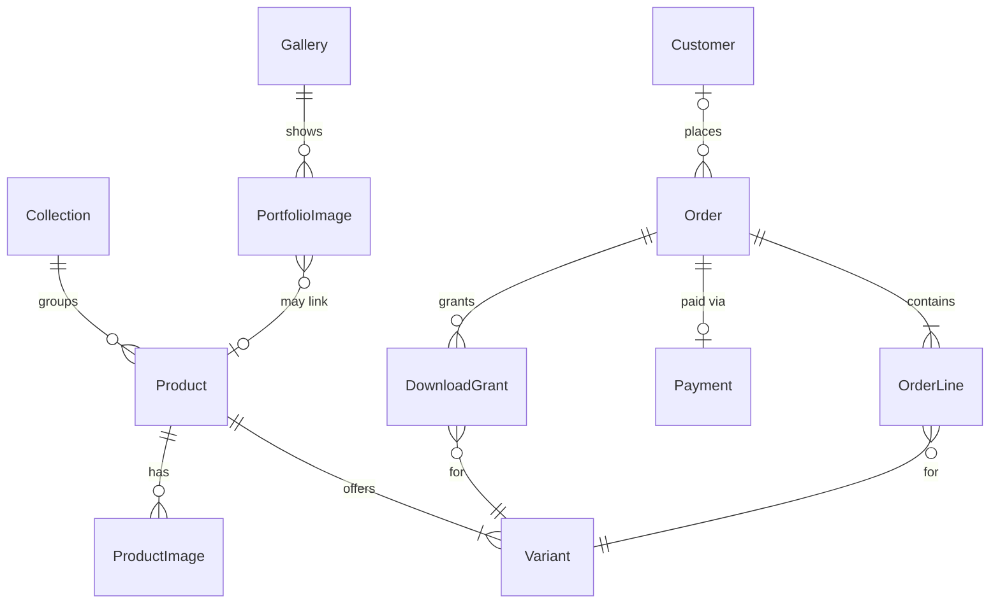

# Architecture Spine — SamThuongShop

## Design Paradigm

**Layered modular monolith** on **Next.js 16 App Router**, server-component-first. One codebase holds the bilingual storefront, the portfolio, and the operator admin. Three layers, dependencies point inward only:

- **Presentation** — `app/` routes + `components/`. React Server Components by default; client components only for interaction. Never touches the database.
- **Application/domain** — `lib/server/` service modules. Owns all business logic and the only Prisma access. Invoked from the presentation layer through **Server Actions** (mutations) and read functions.
- **Integration** — adapters in `lib/server/` for the external systems (payOS, Cloudflare R2, Resend, Auth.js), each behind a narrow interface. Inbound events (payOS webhook, protected downloads, auth callbacks) enter through **Route Handlers** (`app/api/`).

## Invariants & Rules



### AD-1 — Server-first mutation model  [ADOPTED]
- **Binds:** all
- **Prevents:** each feature inventing its own data-fetch/mutation style (mixed client fetch, ad-hoc API routes)
- **Rule:** state changes go through **Server Actions**; external inbound calls (payOS webhook, protected download, auth) go through **Route Handlers**; everything renders as a Server Component unless it needs interaction.

### AD-2 — Domain layer owns persistence
- **Binds:** all data access
- **Prevents:** business logic leaking into components; scattered/duplicated queries
- **Rule:** only `lib/server/` modules import Prisma; presentation calls services/actions, never the DB. One service module owns each aggregate.

### AD-3 — Order is the transactional aggregate with a fixed status machine  [ADOPTED]
- **Binds:** FR-4..FR-14 (cart, checkout, orders, fulfillment, digital delivery)
- **Prevents:** ad-hoc statuses; a print and a download in one cart being handled inconsistently
- **Rule:** statuses are exactly *Pending Payment → Paid → Processing → Shipped → Completed*, plus *Cancelled*. COD orders enter at *Processing*; digital delivery timing and mixed-order tracks are governed by AD-12. Status transitions happen only in the order service. An **order confirmation is emailed** (Resend) on order creation (FR-10).

### AD-4 — Payment success is server-verified only
- **Binds:** FR-8, FR-9, FR-13 (payments, digital delivery)
- **Prevents:** trusting a client redirect for "Paid"; hardcoding one gateway
- **Rule:** an Order becomes *Paid* **only** on a signature-verified **payOS webhook** (or Operator confirmation for bank-transfer/COD), never a browser return. Gateways sit behind a `PaymentProvider` interface (payOS today; VNPay/OnePay wallets added later without touching callers). No un-*Paid* order is fulfilled.

### AD-5 — Money is integer VND
- **Binds:** all prices, totals, payments
- **Prevents:** floating-point rounding drift
- **Rule:** all monetary values are integers in Vietnamese đồng (no minor unit) end-to-end — schema, logic, API, and display formatting.

### AD-6 — Digital originals are private; delivered only post-payment
- **Binds:** FR-2, FR-13, FR-14, counter-metric SM-C2
- **Prevents:** leak of un-watermarked files; public/guessable asset URLs
- **Rule:** original files live in a **private R2 bucket** (AD-15), never publicly served. The purchasable file reaches a buyer only via a **short-lived presigned URL** minted (per AD-14 entitlement) after the Order is *Paid*, through a Route Handler that checks entitlement; the link is also **emailed via Resend** (FR-13). The watermarked preview is a **separate derivative generated at upload**; the original is never served before purchase.

### AD-7 — Bilingual content model, Vietnamese-fallback, VND-only
- **Binds:** FR-25, FR-19, FR-22 (i18n, product/portfolio content)
- **Prevents:** single-language schema; translation drift; a stray currency dimension
- **Rule:** translatable fields on Product / Portfolio / About are stored **per-locale (`vi`, `en`)**; missing translations fall back to `vi`. UI strings use **next-intl** with **locale-prefixed routes** (`/vi/…`, `/en/…`, `vi` default); page metadata / OpenGraph follow the active locale. Prices carry no currency dimension — always VND (AD-5).

### AD-8 — Variant format drives fulfillment
- **Binds:** FR-2, FR-4, FR-6, FR-8, FR-11
- **Prevents:** inconsistent handling of physical vs digital across cart, checkout, fulfillment
- **Rule:** each Variant is either a **Physical Print** (size) or a **Digital Download** (tier). One Order may contain both. Shipping applies **iff** any line is physical; COD is offered **iff** no line is digital; **a digital line is fixed at quantity 1** (FR-4); physical prints are made-to-order (no stock).

### AD-9 — Single auth system, operator-gated admin
- **Binds:** FR-19..FR-24 (admin, accounts)
- **Prevents:** ad-hoc/duplicated auth; unprotected admin surface
- **Rule:** **Auth.js v5 (beta — `next-auth@beta`)** with email/password in Postgres is the only auth. Two principals: **Operator** (single privileged role) and **Customer** (optional account). All `app/admin/*` routes and operator Server Actions require the Operator role.

### AD-10 — Order carries its own money, decomposed
- **Binds:** FR-4..FR-9 (cart, checkout, payments)
- **Prevents:** two units computing totals differently; payment charging an amount the order never persisted
- **Rule:** an Order persists integer-VND `subtotalVnd`, `shippingFeeVnd`, `discountVnd`, `grandTotalVnd`. **`grandTotalVnd` is the single amount passed to any `PaymentProvider`.** Shipping is an **Order field, not an OrderLine** (only Variants are lines, AD-8). The order service recomputes totals from the DB at checkout; a client-sent total is never trusted.

### AD-11 — OrderLine snapshots the purchase
- **Binds:** FR-4, FR-10, FR-19 (orders, admin edits)
- **Prevents:** an Operator price/name edit silently re-pricing or re-labeling historical orders; locale drift on old orders
- **Rule:** at creation, each OrderLine **snapshots** `unitPriceVnd`, the Variant format, and the product name in the buyer's locale. Historical order reads use the snapshot and never live-join to the current Variant/Product.

### AD-12 — Fulfillment tracks per format; digital delivers at Paid
- **Binds:** FR-6, FR-11, FR-12, FR-13 (mixed orders, fulfillment, delivery)
- **Prevents:** the AD-3 headline status being unable to represent a mixed order; digital delivery delayed until a physical print ships
- **Rule:** a **DownloadGrant is issued for every digital line the moment the Order is *Paid*** (not at *Completed*). The Order's headline status (AD-3) tracks the **physical** fulfillment track; an Order with no physical line short-circuits to *Completed* once grants issue. Cancellation may apply per track (a shipped print + delivered download need not cancel together).

### AD-13 — Order-state transitions are atomic and idempotent
- **Binds:** FR-8..FR-12 (payments, fulfillment)
- **Prevents:** a replayed/duplicate payOS webhook double-fulfilling; an Operator Cancel racing the Paid webhook (lost update)
- **Rule:** `Payment` carries a **unique payOS reference**; webhook handling is an upsert-and-no-op inside one transaction. Status transitions are a **compare-and-set on the expected current status** (monotonic — a later "expired" event cannot un-set *Paid*; *Paid* wins a race with *Cancel*, which then routes to a refund path). Grant issuance and emails are dispatched **once per (order, purpose) key**.

### AD-14 — DownloadGrant is a durable entitlement; redemption is authenticated
- **Binds:** FR-13, FR-14, SM-C2 (digital delivery, re-download, no-leak)
- **Prevents:** ambiguous one-shot-vs-durable grants; a stranger redeeming a download or PII via a guessable order code
- **Rule:** a **DownloadGrant** is a durable entitlement (order + digital Variant) that **mints short-lived presigned URLs on demand** under an explicit expiry/count policy `[ASSUMPTION: policy values pending PRD Open Q5]`. Redemption — by account **or** guest — requires proof: signed-in ownership, or **order reference _plus_ purchaser email** (adequate code entropy + rate limiting). The presigned URL (AD-6) is the only path to the original file.

### AD-15 — Two-tier asset storage, non-derivable keys
- **Binds:** FR-2, FR-6, FR-13, SM-C2 (media, previews, downloads)
- **Prevents:** an upload unit and a storefront unit disagreeing on where originals vs previews live; a preview key that reveals the original
- **Rule:** **private R2** holds original download files (served only via AD-6/AD-14); public display/preview assets (product/gallery images, watermarked previews) are served for viewing. Every stored object key is **non-derivable** (random) and **owned by its DB record** (Variant/ProductImage) — one unit never guesses another's path.

## Consistency Conventions

| Concern | Convention |
| --- | --- |
| Entity naming | PascalCase domain nouns matching the PRD Glossary: `Product`, `Variant`, `Collection`, `Order`, `OrderLine`, `Customer`, `Payment`, `DownloadGrant`, `PortfolioImage`, `Gallery`. |
| Files / routes | kebab-case files; localized routes under `app/[locale]/`; admin under `app/admin/`; inbound handlers under `app/api/`. |
| IDs & references | DB keys `cuid()`; human-facing Order reference a short uppercase code (used for guest lookup, FR-10). |
| Money & dates | integer VND (AD-5); timestamps stored UTC ISO-8601, formatted per locale at the edge. |
| Content & i18n | per-locale `vi`/`en` fields (AD-7); UI copy in `messages/{vi,en}.json` via next-intl; `vi` is the fallback. |
| Mutations & errors | Server Actions return a typed `{ ok, data \| error }` result; validate at the service boundary (zod); never trust a client-sent price — recompute from the DB. |
| Secrets & config | all provider keys (payOS, R2, Resend, Auth.js, DB) via environment variables; never in the client bundle. |
| Auth | Auth.js session; role check in a shared server guard (AD-9). |
| Media & images | public display/gallery images served through **next/image** with responsive sizes and reserved aspect ratios (PRD §10 image performance); originals/previews per AD-15. |
| Metadata & SEO | per-page metadata + OpenGraph generated per active locale (AD-7); product/portfolio pages indexable, `alt` text per EXPERIENCE convention. |
| Email | one `lib/server/email` module (Resend) sends all transactional mail — order confirmation (AD-3), download link (AD-6); templates bilingual per the order's locale. |

## Stack

| Name | Version |
| --- | --- |
| Next.js (App Router) | 16.2.x |
| React | 19.x |
| TypeScript | 5.x |
| Prisma | 7.x |
| PostgreSQL (Supabase, Singapore) | 17 |
| next-intl | current |
| Auth.js (NextAuth) | 5.x (beta — `next-auth@beta`) |
| payOS Node SDK (VietQR) | current |
| Cloudflare R2 (S3 API) | — |
| Resend | current |
| Tailwind CSS (Sky & Sedge tokens) | 4.x |
| Hosting | Vercel (`sin1` Singapore) |

## Structural Seed

**Containers & external systems**



**Environments:** local dev (Supabase Postgres (Singapore), R2 dev bucket, **`PaymentProvider` mocked** — payOS has no public sandbox, so the AD-4 interface is stubbed locally) → production (Vercel prod + Supabase `ap-southeast-1` + R2 prod bucket). The payOS webhook and download Route Handlers are the only unauthenticated public API surfaces; both verify signatures / entitlement. *(Pinning Vercel functions to `sin1` requires a Pro plan — confirm account tier.)*

**Core entities**



**Source tree (cold-start scaffold — code owns the detail)**

```text
samthuongshop/
  app/
    [locale]/              # localized public site (next-intl)
      (shop)/              # catalog, collection, product, cart, checkout, order
      (portfolio)/         # galleries, about, contact
      (account)/           # login, order history, re-download
    admin/                 # operator-only (AD-9): products, orders, portfolio
    api/                   # Route Handlers: payos-webhook, download, auth
  lib/server/              # domain services (only Prisma access) + adapters:
                           #   order, product, payment(payOS), storage(R2), email(Resend), auth
  components/              # RSC + client UI (DESIGN.md tokens)
  messages/                # vi.json, en.json
  prisma/                  # schema, migrations
```

## Capability → Architecture Map

| Capability / Area | Lives in | Governed by |
| --- | --- | --- |
| Catalog & storefront (FR-1..FR-3) | `app/[locale]/(shop)`, `lib/server/product` | AD-2, AD-7, AD-8, AD-15 |
| Cart & checkout (FR-4..FR-7) | `(shop)` checkout, `lib/server/order` | AD-3, AD-5, AD-8, AD-10, AD-11 |
| Payments (FR-8, FR-9) | `lib/server/payment`, `api/payos-webhook` | AD-4, AD-5, AD-10, AD-13 |
| Orders & fulfillment (FR-10..FR-12) | `lib/server/order`, admin | AD-3, AD-8, AD-11, AD-12, AD-13 |
| Digital delivery & licensing (FR-13..FR-15) | `api/download`, `lib/server/storage` | AD-6, AD-12, AD-14, AD-15 |
| Portfolio & about (FR-16..FR-18) | `app/[locale]/(portfolio)` | AD-2, AD-7, AD-15 |
| Operator admin (FR-19..FR-23) | `app/admin`, domain services | AD-9, AD-2 |
| Accounts & auth (FR-24, FR-25) | `(account)`, `lib/server/auth` | AD-9, AD-7 |

## Deferred

- **Momo/ZaloPay wallet balances** — ⚠️ **diverges from the PRD**, which lists Momo/ZaloPay as v1 methods (FR-8, §6.1, UJ-1/UJ-2) and EXPERIENCE's checkout shows them. As a solo/household merchant these wallets need a registered business + VNPay/OnePay contract, so **v1 accepts payOS (VietQR) + COD only**; wallets add later as a new `PaymentProvider` (AD-4). *Action: update PRD FR-8/FR-9 + EXPERIENCE payment selector to match.*
- **Shipping-rate model** — v1 treats shipping as one Operator-configured flat fee (PRD Open Q2); tiered/weight-based rating deferred.
- **Exact print sizes / digital tiers** — placeholder Variants until confirmed (PRD Open Q4); no architectural impact.
- **Search depth** — Postgres name search for v1; a faceted/full-text search engine is deferred.
- **Observability & rate limiting** — Vercel/Supabase defaults for v1; dedicated logging/metrics and rate limits deferred until traffic warrants.
- **CI/CD & backups** — Vercel Git deploys + Supabase automatic backups for v1; a formal pipeline is deferred.
- **Operator bootstrap & seed** — the single Operator account is created via a Prisma seed/migration script (no self-serve operator signup, AD-9); broader seed/reference data deferred to build time.
- **Download expiry/count policy** — the concrete expiry window and re-download count for AD-14 grants await PRD Open Q5.
